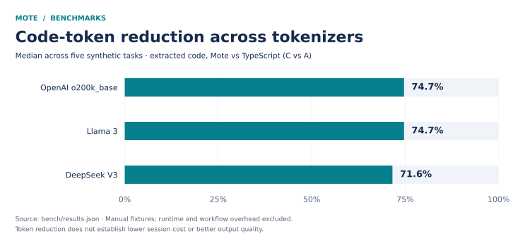
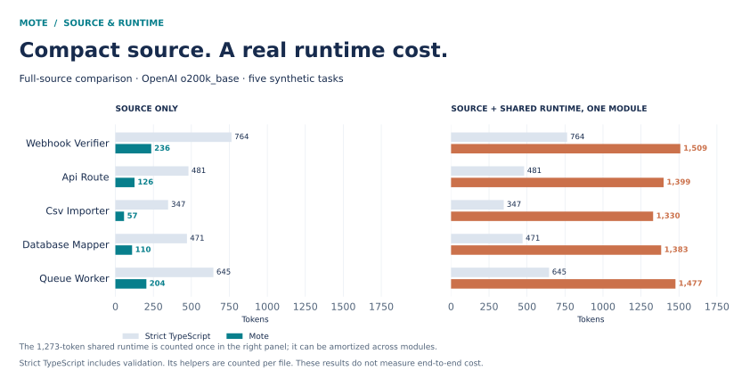

# Mote

A typed, token-efficient programming language that compiles to readable TypeScript.

Created by **Hosam Talbi**.

Mote explores how compact syntax can reduce source-code token counts while preserving type checking, runtime validation, and interoperability with Node.js. Its compiler emits inspectable TypeScript or JavaScript, declaration files, and source maps.

**Status: experimental.** Includes a compiler, command-line interface, formatter, examples, and a reproducible benchmark suite.

## Language features

- Typed declarations, functions, structural records, and optional fields.
- Static checking with stable diagnostic codes and explanations.
- Runtime schemas derived from types for validating external JSON.
- TypeScript and JavaScript output, declarations, and coarse source maps.
- Node/npm imports and compact or readable formatting.

```mote
type Payment={amount:num,currency:str?}

fn describe(p:Payment)={
  amount:p.amount,
  currency:p.currency??"SAR"
}

let raw='{"amount":154,"currency":"SAR"}'
let payment=json<Payment>(raw)?
console.log(describe(payment))
```

`json<Payment>(raw)?` parses and validates input against a generated runtime schema, then unwraps the result or throws a validation error.

## Getting started

Install a current Node.js LTS release and npm, then:

```sh
git clone https://github.com/iO7i/mote.git
cd mote
npm ci
node bin/mote.mjs check examples/typed-webhook.mt
node bin/mote.mjs run examples/typed-webhook.mt
npm test
```

To inspect and check the generated TypeScript:

```sh
node bin/mote.mjs compile examples/typed-webhook.mt --out dist
npx tsc -p dist/tsconfig.json
```

## Command-line interface

Run commands with `node bin/mote.mjs`.

```text
check <file|dir>                 Type-check source
compile <file|dir> --out <dir>    Emit TypeScript, declarations, and runtime
run <file.mt>                    Check and execute a program
emit <file.mt> [--js]            Print generated TypeScript or JavaScript
fmt <file.mt> --compact          Format source; --readable is also supported
measure <file.mt> --json         Produce a heuristic token estimate
explain <M-code>                 Explain a compiler diagnostic
```

## Benchmarks





The included report records five synthetic tasks with behavior and mutation tests. Across OpenAI o200k_base, Llama 3, and DeepSeek V3 tokenizers, the reported median extracted code-token reduction is **71.6–74.7%**. The separate full-source comparison against strict TypeScript records a **73.8%** median reduction using o200k_base, before shared runtime overhead.

These are fixture measurements from manual runs, not evidence of lower end-to-end cost or improved output quality. Results depend on workload and tokenizer. The roughly 1,300-token validation runtime can outweigh the savings of one small module before its cost is amortized. Code and explanatory text are measured separately; their percentage savings must not be added together.

```sh
node bench/audit.mjs
node bench/run.mjs
```

See [methodology](docs/BENCHMARKS.md) and the [detailed report](bench/REPORT.md) for baselines and limitations.

Charts are generated from `bench/results.json`. To regenerate them, install Python with Matplotlib and run `python bench/charts.py`.

## Repository structure

| Directory | Contents |
| --- | --- |
| `src` | Lexer, parser, checker, emitter, formatter, and runtime |
| `bin` | Command-line entry point |
| `tests` | Compiler, runtime, formatter, and end-to-end tests |
| `examples` | Runnable language examples |
| `bench` | Reference implementations, fixtures, measurements, and audit harness |
| `docs` | Specification and technical documentation |

Pipeline: source → lexer → parser → type checker → emitter → TypeScript/JavaScript.

## Documentation and boundaries

- [Language specification](docs/SPEC-v0.2.md)
- [Type system](docs/TYPES.md)
- [Runtime validation](docs/RUNTIME-VALIDATION.md)

Classes, inheritance, decorators, macros, native compilation, a browser runtime, a full language server, and advanced type-level programming are outside the current implementation.

License: MIT.
